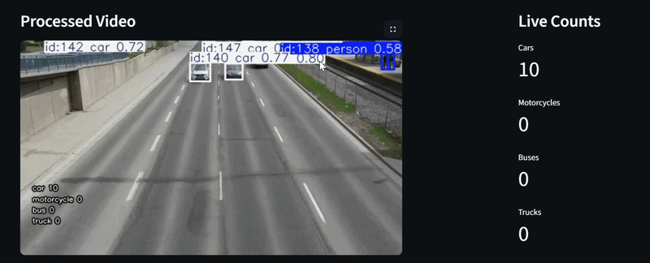

# 🚗 Vehicle Counting App — YOLOv8 + Streamlit

A real‑time vehicle detection and counting web application built with YOLOv8, OpenCV, and Streamlit.
Upload any traffic video and the app will detect, track, and count vehicles (cars, motorcycles, buses, trucks) 

** For code access or questions, please contact me at: tst1880@googlemail.com **

# Demo

# How It Works
- The user uploads a video through the Streamlit interface
- YOLOv8 performs object detection on each frame

# Programs used

- Python 3.10+
- YOLOv8 (Ultralytics)
- OpenCV
- Streamlit
- NumPy
- Pandas
